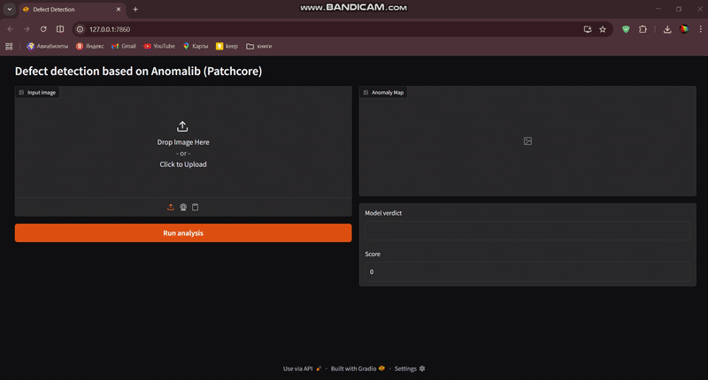

# 🔍 Industrial Defect Detection with PatchCore

Unsupervised anomaly detection system for industrial quality control using **PatchCore** and the **MVTec AD** dataset. Detects surface defects on industrial products without requiring labeled defect data during training.

)

---

## 🎯 Results

| Metric | Score |
|--------|-------|
| Image AUROC | **1.000** |
| Image F1 Score | **0.992** |
| Pixel AUROC | **0.986** |
| Pixel F1 Score | 0.728 |

> Trained on the **Bottle** category of MVTec AD dataset.

---

## 🧠 How It Works

PatchCore is a state-of-the-art anomaly detection method that:
1. Extracts patch-level features from a pretrained backbone (WideResNet-50)
2. Builds a memory bank of normal surface features
3. At inference, computes anomaly score by comparing input patches to the memory bank
4. Generates a heatmap highlighting defective regions

No defect images are needed during training — only normal samples.

---

## 📸 Example Output

| Input Image | Anomaly Heatmap | Verdict |
|-------------|-----------------|---------|
| Normal bottle | 🔵 All blue | ✅ Normal (score < 0.5) |
| Broken bottle | 🔴 Red on crack area | ❌ Anomaly (score: 0.83) |
| Contaminated bottle | 🔴 Red on contamination | ❌ Anomaly (score: 0.91) |

---

## 🚀 Quick Start

```bash
git clone https://github.com/muxammadali74/industrial-defect-detection
cd industrial-defect-detection
pip install -r requirements.txt
```

### Run the demo app
```bash
python app.py
```
Open `http://localhost:7860` in your browser, upload an image and click **Run analysis**.

---

## 🛠️ Tech Stack

- **anomalib** — industrial anomaly detection library
- **PyTorch** — deep learning framework
- **Gradio** — interactive demo interface
- **MVTec AD** — industrial anomaly detection benchmark dataset

---

## 📁 Project Structure

```
industrial-defect-detection/
├── src/
│   ├── train.py          # Model training
│   └── inference.py      # Single image inference
├── app.py                # Gradio web demo
├── assets/
│   └── demo.gif          # Demo animation
├── requirements.txt
└── README.md
```

---

## 📊 Dataset

[MVTec AD](https://www.mvtec.com/company/research/datasets/mvtec-ad) — benchmark dataset for industrial anomaly detection with 15 categories.

> **This model is trained on the Bottle category only.** Upload bottle images for best results. The same approach can be applied to any other MVTec category (wood, leather, metal, tile, etc.) with retraining.

---

## 💼 Use Cases

- **Manufacturing** — detect surface scratches, cracks, contamination
- **Packaging** — identify broken or deformed products
- **Quality Control** — automate visual inspection on production lines

---

## 📬 Contact

Built by [Muxammad Ali](https://www.upwork.com/freelancers/~01785c6923d061132d) — Computer Vision Engineer  
Open for freelance projects on Upwork.
